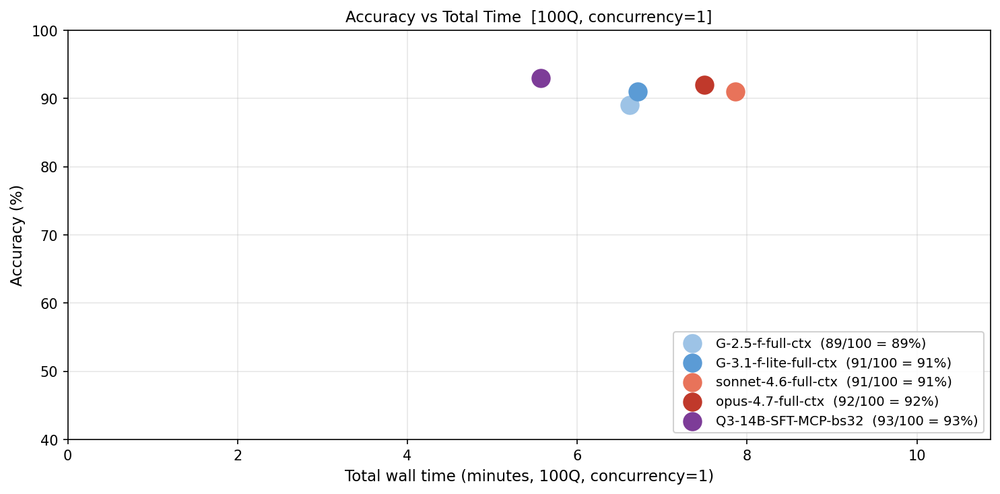

# Training a Custom Model for Deep Paper QA with Paperclip as an MCP Tool

A tech report on building **Qwen3-14B-Paper** — a small, open-weight model that
answers deep, evidence-grounded questions about biomedical preprints by *using a
tool* (the **paperclip** corpus engine, exposed over MCP) rather than by
memorizing papers. We distill an agentic teacher into the model with SFT, then
sharpen its tool-use and answer accuracy with RL.

---

## 1. Motivation

State-of-the-art "deep research" over the scientific literature today is done by
large frontier models (Claude, GPT, Gemini) driving search/read tools in a loop.
That works, but it is:

- **Expensive** — every question is many frontier-model calls over long contexts.
- **Closed** — you cannot self-host, fine-tune, or run it offline.
- **Hard to control** — answer style, citation discipline, and stopping behavior
  are baked into a model you do not own.

The thesis of this project: **the hard part of paper QA is not raw model
intelligence — it is disciplined tool use over a good corpus.** If a model can
(a) find the right paper, (b) read exactly the right passages, and (c) stop and
answer concisely, then a 14B open model is enough. The intelligence lives in the
*tool* (paperclip, indexing 8M+ papers) and in the *policy* we train for using it.

So we train a **custom 14B model** whose only superpower is knowing how to drive
paperclip well — a cheap, self-hostable "paper reader" that can be embedded
anywhere the corpus is reachable.

### Why MCP?

We expose paperclip as a **Model Context Protocol (MCP)** server. MCP gives us one
clean contract that is identical across three very different consumers:

| Consumer | How it reaches paperclip |
|---|---|
| **Teacher** (Claude, during data collection) | MCP tool call |
| **RL rollouts** (verl-tool actor) | HTTP MCP tool server |
| **Eval / production** (vLLM-served checkpoint) | same MCP endpoint |

Because the tool surface never changes, a trajectory the teacher produced is
*replayable* by the student, and a policy trained in RL behaves identically at
eval time. The model only ever sees **one tool** — `paperclip(command=...)` — and
learns to compose shell-like commands against it.

---

## 2. The Tool: Paperclip over MCP

**Paperclip** is a CLI/HTTP engine over 8M+ full-text papers (bioRxiv, medRxiv,
PubMed Central). The agent calls a single MCP tool and passes a shell-like
command string:

```jsonc
{
  "name": "paperclip",
  "arguments": {
    "command": "lookup doi 10.1101/2025.11.22.689941",
    "description": "Locate the paper by DOI"
  }
}
```

Core commands the policy learns to use:

- `search "<query>"` — hybrid BM25 + vector search across the corpus
- `grep "<regex>" /papers/` — sub-second server-side regex over all 8M papers
- `lookup doi <DOI>` — resolve a paper and `cd` into its directory
- `cat` / `head` / `sed` / `scan file "p1" "p2"` — targeted reads of `content.lines`
- `lookup-citation` — find every in-text mention of a reference
- `map` / `sql` — fan-out over many papers / structured queries

Each paper is a small read-only filesystem the agent navigates:

```
/papers/{uuid}/meta.json        # title, authors, doi
/papers/{uuid}/content.lines    # full text with block IDs
/papers/{uuid}/sections/        # sections
/papers/{uuid}/supplements/     # supplementary material
```

The agent's behavior contract (system prompt, `agents/papers/papers_reader.yaml`)
is deliberately strict: **do exactly what was asked, then stop.** No
over-delivery, no anticipating follow-ups. This makes both the SFT targets and
the RL reward well-defined.

The MCP server runs at `http://localhost:8083` and is the *same* endpoint for
data collection, RL rollouts, and evaluation.

---

## 3. Overall Pipeline

```
                       ┌─────────────────────────────────────────┐
                       │  Paperclip MCP  (8M+ papers @ :8083)      │
                       └───────────────▲─────────────▲────────────┘
                                       │             │
        (1) DISTILL                    │             │   (3) RL ROLLOUTS
   Claude teacher drives paperclip     │             │   student drives paperclip
   → multi-turn traces                 │             │   → reward from correctness
                                       │             │
   collect_sft_data.py ───► judge_accuracy.py ──► merged_*.parquet
                                       │
                                       ▼
                       (2) SFT: Qwen3-14B + LoRA on traces
                       train_sft_32k_1ep.sh  (verl MultiTurnSFTDataset)
                                       │
                                       ▼
                       merge_sft_checkpoint.py  (LoRA → full HF)
                                       │
                                       ▼
                       (3) RL: GRPO, reward_manager=biomedrxiv
                       train_rl.sh  (verl-tool agentic PPO)
                                       │
                                       ▼
                       (4) EVAL: vLLM + paperclip tool loop, Claude judge
                       eval_with_tools.py
```

**Base model:** `Qwen/Qwen3-14B`.
**Engine:** [`verl`](https://github.com/volcengine/verl) + `verl-tool` (agentic
tool-use extensions), FSDP, LoRA (`rank=16, alpha=32`).

---

## 4. Stage 1 — Data Collection (Distillation)

We do **not** hand-write trajectories. We let a strong teacher (Claude
Sonnet 4.6, configured in `papers_reader.yaml`) answer real evaluation questions
*while driving paperclip*, and record the full multi-turn conversation.

`collect_sft_data.py`:
- Runs the teacher agent on each eval question (concurrently).
- Captures the **complete trace**: system prompt + every `tool_call` + every tool
  **result** + the final answer.
- Tool calls and results are rebuilt from the session DB so the saved trace is an
  exact, replayable transcript.
- `--only-passing` keeps only traces that answered correctly.

`judge_accuracy.py`:
- Each question carries ground-truth `criteria` (e.g. `"The solution is: 95%"`).
- Claude judges each final answer → `{"pass": bool, "reason": str}`.
- Reports per-category accuracy; only passing traces survive into SFT.

Two sources are merged (`build_sft_data.sh`):
- `xulong_*` traces (main-text QA)
- `supp_*` traces (supplementary-material QA, the harder split)

`convert_to_sft_parquet.py` emits the final training file with a schema the
trainer reads directly:

| Column | Contents |
|---|---|
| `messages` | `system` → `user` → (`assistant` w/ `tool_calls` → `tool` result)\* → `assistant` answer |
| `tools` | the single `paperclip` tool schema |

**Final SFT set: `merged_biomedrxiv_sft_train.parquet` — 1,353 multi-turn traces**
(avg ~11 turns/trace, up to 87). Role counts: 1,353 system / 1,353 user /
6,700 assistant / 5,347 tool.

---

## 5. Stage 2 — Supervised Fine-Tuning (SFT)

We teach the student to *imitate the teacher's tool-use trajectory*. Training uses
`verl`'s `MultiTurnSFTDataset`, which:

1. Applies the Qwen3 chat template with the `paperclip` tool definition attached.
2. Tokenizes the whole conversation.
3. **Masks the loss to assistant turns only** — the model learns to produce tool
   calls and final answers, but is *not* trained on tool outputs or the user
   turn. Per-turn masking is reconstructed by diffing chat-template prefixes.

> **Implementation note (Qwen3 `<think>` handling):** Qwen3's chat template strips
> `<think>…</think>` from *historical* assistant turns but keeps it on the current
> one, so per-turn re-tokenization can drift a few tokens from a single full-pass
> tokenization. The dataset detects this and falls back to the concatenated
> per-turn tokens (logged as `Token mismatch detected … Using concatenated
> version`). This is expected, not an error.

### Configuration (`train_sft_32k_1ep.sh`)

```bash
python -m verl.trainer.sft_trainer \
    data.train_files=merged_biomedrxiv_sft_train.parquet \
    data.messages_key=messages  data.tools_key=tools \
    data.max_length=32768  data.truncation=right \
    data.pad_mode=no_padding  data.micro_batch_size_per_gpu=1 \
    data.train_batch_size=8 \
    model.path=Qwen/Qwen3-14B \
    model.lora_rank=16  model.lora_alpha=32 \
    model.enable_gradient_checkpointing=True \
    engine.model_dtype=bfloat16 \
    trainer.total_epochs=1  trainer.save_freq=50
```

- **LoRA** (`r=16, α=32`) over `all-linear` — only the adapter trains; the 14B base
  stays frozen, keeping the checkpoint tiny and training cheap.
- **No-padding packing** at up to 32k tokens — agent traces are long.
- **Context length matters for memory.** A single 80 GB GPU does *not* fit 32k
  context with offload disabled (the 14B base alone resides at ~56 GB, then 32k
  activations OOM). For single-GPU runs, either (a) reduce context to 8k, or
  (b) enable FSDP offload:
  `engine.param_offload=True engine.optimizer_offload=True
  model.enable_activation_offload=True`.

### Hardware / environment (validated on RunPod A100 80 GB)

A reproducible smoke run on a fresh A100 80 GB pod (8k context + offload)
trained cleanly:

```
step:1  loss 0.825   grad_norm 1.04   mfu 0.45
step:10 loss 0.217   grad_norm 0.16   mfu 0.55   → checkpoint saved
```

Environment pins that matter (driver CUDA 12.5 on the test pod):
- `torch==2.6.0+cu124` (newer cu12.8/cu13 wheels need a newer driver)
- `transformers==4.52.4` (Qwen3 support; avoids v5 chat-template churn)
- `flash-attn==2.7.4.post1` prebuilt wheel for `cu12/torch2.6/py311`
- `tensordict==0.7.2` (matches torch 2.6), plus `ray`, `hydra-core`, `orjson`
- Remove the `pyext` dep from `verl-tool` (uses `inspect.getargspec`, gone in 3.11)

After training, `merge_sft_checkpoint.py` folds the LoRA adapter back into the
base weights to produce a standalone HF model for RL and serving.

---

## 6. Stage 3 — Reinforcement Learning (GRPO)

SFT gives a student that *mimics* the teacher. RL makes it *better than the
imitation* by optimizing directly for correct, efficient answers — with the
**real paperclip tool in the loop**.

We use **GRPO** (Group Relative Policy Optimization) via `verl-tool`'s agentic PPO
trainer (`train_rl.sh`):

- **Agentic rollouts:** the policy generates `<tool_call>…</tool_call>`, a tool
  server executes it against the live MCP, the observation is fed back, repeat up
  to `max_turns=8`. Tool-result tokens are **masked** from the policy loss
  (`mask_observations=True`) — we only reinforce the model's own tokens.
- **GRPO group:** `n=8` rollouts per prompt; advantages are computed relative to
  the group mean (no learned critic needed).
- **Tool server:** `verl_tool.servers.serve --tool_type http_mcp` wraps paperclip;
  the actor POSTs actions and gets observations back.
- **Policy:** LoRA (`r=16, α=32`) on the merged SFT checkpoint, FSDP with
  param/optimizer offload, vLLM for fast rollout generation.

### Reward (`reward_manager=biomedrxiv`)

Ground truth is a criterion string like `"The solution is: ~20 kcal/mol"`. The
reward function:

1. **Correctness** — exact normalized substring match, *or* numeric proximity
   (every expected number matched within 15% → correct; partial → 0.5).
2. **Token-efficiency bonus** (only when correct) — shorter correct answers score
   higher:
   `score = accuracy·(1−w) + efficiency·w + tool_bonus`, with `w=0.2`,
   `efficiency = 1 − tokens/max_tokens`.
   → correct in 400 tok ≈ 0.98; correct in 4000 tok ≈ 0.80; wrong ≈ 0.0.
3. **Tool-use bonus** — `+0.1` for emitting any valid tool call, to bootstrap the
   habit of actually consulting the paper instead of hallucinating.

This reward shape directly encodes the project thesis: **be correct, be grounded
in the paper, and be concise.**

RL data (`build_rl_data.py`) is built from `supp_evals.json` into the verl RL
schema (`data_source, prompt, ability=paper_qa, reward_model.ground_truth,
extra_info`).

```bash
bash qwen_rl/train_rl.sh --checkpoint global_step_100   # RL on a merged SFT ckpt
# GRPO, n=8 rollouts, batch 16, lr 1e-6, max_turns 8, 5 epochs
```

---

## 7. Stage 4 — Evaluation

`eval_with_tools.py` measures the *end-to-end agent*, not just next-token loss:

1. Serve the checkpoint with **vLLM** (OpenAI-compatible API).
2. For each question, run the full tool loop: model emits `<tool_call>`, we
   execute it against the **same paperclip MCP**, feed results back, up to
   `max_iterations`.
3. **Judge** final answers with Claude against the ground-truth criteria.
4. Report **per-category accuracy**.

```bash
vllm serve qwen_rl/checkpoints/global_step_100_merged --port 8001
python qwen_rl/eval_with_tools.py \
    --vllm-url http://localhost:8001 \
    --eval-file qwen_rl/data/_test_50.json \
    --output    qwen_rl/eval_results/step100.json
```

**Baselines for comparison:**
- `eval_context_baseline.py` — the same questions answered with the relevant text
  pasted into the prompt and **no tools** (isolates "can it read?" from "can it
  retrieve?").
- Frontier teacher accuracy from `judge_accuracy.py` (the distillation ceiling).

The judge contract is intentionally minimal:
`{"pass": true/false, "reason": "one sentence"}`, so accuracy is reproducible and
category-sliced.

---

## 8. Results

**A 14B open model driving paperclip over MCP matches or beats frontier models
that are handed the full paper — at the lowest latency.**



*Accuracy vs. total wall time, 100 questions, concurrency = 1. Up-and-to-the-left
is better.*

| Model | Setup | Accuracy | Wall time (100Q) |
|---|---|---|---|
| Gemini 2.5 Flash | full-context, no tool | 89% | ~6.6 min |
| Gemini 3.1 Flash-lite | full-context, no tool | 91% | ~6.7 min |
| Claude Sonnet 4.6 | full-context, no tool | 91% | ~7.9 min |
| Claude Opus 4.7 | full-context, no tool | 92% | ~7.5 min |
| **Q3-14B-SFT-MCP (ours)** | **paperclip via MCP** | **93%** | **~5.6 min** |

The custom Qwen3-14B is both the **most accurate (93%)** and the **fastest
(~5.6 min)** — because it retrieves only the passages the question needs instead
of ingesting the whole paper. These numbers are from the **SFT checkpoint**
(before RL); GRPO targets the harder supplementary splits next. Eval via
`eval_with_tools.py` and full-context baselines, judged by Claude against
ground-truth criteria.

## 9. Reproduction

```bash
# 0. Start the paperclip MCP server (corpus engine) at :8083

# 1. Collect + judge teacher traces, build the SFT parquet
bash qwen_rl/build_sft_data.sh
#   → merged_biomedrxiv_sft_train.parquet  (1,353 traces)

# 2. SFT (single A100 80GB: use 8k context or enable offload)
bash qwen_rl/train_sft_32k_1ep.sh
python qwen_rl/merge_sft_checkpoint.py --checkpoint <ckpt> --output <ckpt>_merged

# 3. RL with the live tool in the loop (GRPO)
bash qwen_rl/train_rl.sh --checkpoint global_step_100

# 4. Evaluate end-to-end
bash qwen_rl/run_eval.sh --checkpoint global_step_100 --batch-size 4
```

### RunPod one-pod recipe (A100/H100 80 GB)

```bash
# rsync repo to /workspace/gxl (exclude .venv, .git, wandb, checkpoints*)
cd /workspace/gxl && bash qwen_rl/runpod_bootstrap.sh   # venv + model download
cd /workspace/gxl/qwen_rl && bash train_sft_32k_1ep.sh  # train
```

---

## 10. Design Notes & Lessons

- **The tool is the model's knowledge.** We never fine-tune facts into weights; the
  model learns *procedure*. Update the corpus, and the model is instantly current.
- **One tool, many commands.** Exposing paperclip as a single `command`-string tool
  (instead of dozens of typed tools) keeps the action space small and lets the
  policy reuse shell idioms it already knows.
- **Mask everything that isn't the policy's voice.** Both SFT (assistant-only loss)
  and RL (`mask_observations`) train only on the model's own tokens — tool outputs
  are context, never targets.
- **Reward conciseness, not just correctness.** The token-efficiency term fights the
  "dump the whole paper" failure mode and matches the strict system-prompt contract.
- **Distill → RL, in that order.** SFT alone reaches teacher-imitation; GRPO with a
  correctness reward and the real tool pushes past it on the hard supplementary
  split.

---

## Repository Layout

```
qwen_rl/
├── collect_sft_data.py        # run teacher → multi-turn traces
├── judge_accuracy.py          # Claude judge vs ground-truth criteria
├── build_sft_data.sh          # filter + merge + → parquet
├── convert_to_sft_parquet.py  # traces → {messages, tools} parquet
├── train_sft_32k_1ep.sh       # SFT: Qwen3-14B + LoRA (verl)
├── merge_sft_checkpoint.py    # LoRA adapter → full HF model
├── build_rl_data.py           # eval JSON → RL parquet
├── train_rl.sh                # GRPO agentic RL (verl-tool)
├── eval_with_tools.py         # vLLM + paperclip loop + Claude judge
├── eval_context_baseline.py   # no-tool baseline
├── run_eval.sh                # eval driver
├── runpod_bootstrap.sh        # provision a GPU pod
└── verl-tool/                 # verl fork w/ agentic tool-use + biomedrxiv reward
```

*This report documents the training methodology. The corpus engine (paperclip) and
the GXL evaluation/agent infrastructure are separate components.*
